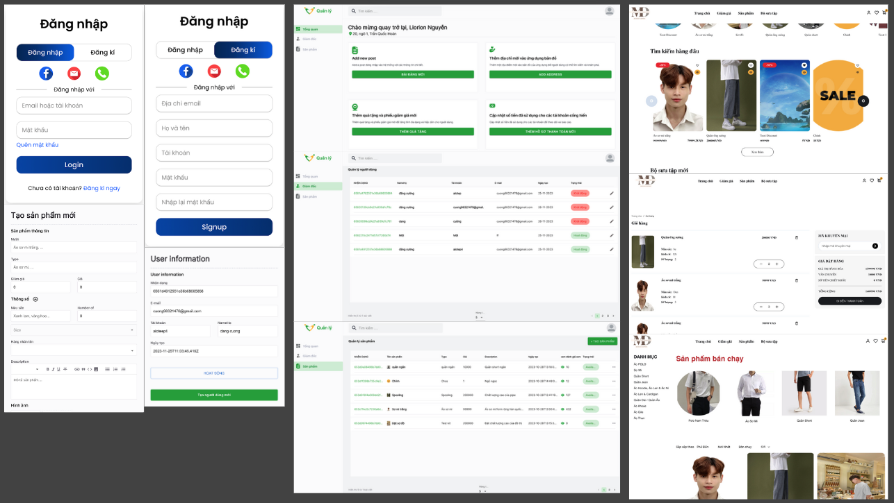

# Modish Dapper

## Mô tả dự án

Dự án "Modish Dapper" là một hệ thống thương mại điện tử, được phát triển bằng công nghệ ReactJS cho phần front end và NestJS cho phần back end. Hệ thống này được thiết kế để kết nối người tiêu dùng với các sản phẩm thời trang, tạo ra một nền tảng hiệu quả cho việc mua sắm trực tuyến.

Hệ thống hoạt động tốt trên cả máy tính để bàn và thiết bị di động, mang đến trải nghiệm người dùng thân thiện và dễ sử dụng.

**Các tính năng chính:**
- Người dùng có thể duyệt và tìm kiếm các sản phẩm thời trang, bao gồm thông tin chi tiết về sản phẩm và giá cả.
- Hệ thống cho phép người dùng thêm sản phẩm vào giỏ hàng và thực hiện thanh toán một cách dễ dàng.
- Giao diện người dùng được thiết kế trực quan, giúp người dùng dễ dàng tương tác và mua sắm.

## Phân hệ
- **Phần Admin:** Quản lý sản phẩm, đơn hàng và người dùng. Admin có thể thêm, sửa, xóa sản phẩm và theo dõi tình trạng đơn hàng.
- **Giao diện Người Dùng:** Cung cấp trải nghiệm mua sắm cho người tiêu dùng, cho phép họ duyệt sản phẩm, thêm vào giỏ hàng và thanh toán.

## Công nghệ sử dụng:
* [ReactJS:](https://reactjs.org/) Thư viện JavaScript phổ biến để xây dựng giao diện người dùng.
* [NestJS:](https://nestjs.com/) Framework cho Node.js, giúp phát triển các ứng dụng server-side hiệu quả.
* [Redux:](https://redux.js.org/) Thư viện quản lý trạng thái cho các ứng dụng JavaScript.
* [MongoDB:](https://www.mongodb.com/) Hệ quản trị cơ sở dữ liệu NoSQL, cho phép lưu trữ và quản lý dữ liệu linh hoạt.

## Figma:
[Figma](https://www.figma.com/design/HoJ6Uezw4R9YV7wWfcogGY/Ecommerce-clothing-store-website-design-(Community)?node-id=272-1082&node-type=canvas&t=SNiTk8aL7yy85D85-0)

# Demo
